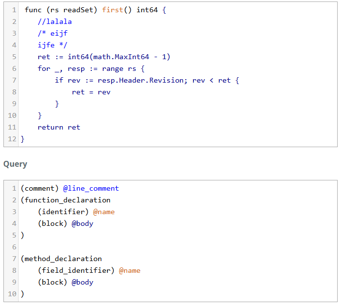

## AI 2Lab
### Есаян Марк Леванович

#### Описание решения
1) Был модифицирован main.py, а именно argparse. 
   2) Добавлено:
      1) Выбор языка
      2) Количество Entry в датасете
   3) Убрано:
      1) Путь датасета (вместо этого он всегда скачивается с code_search_net)

#### Запуск python
Дефолтные значения настроены под питон
```cmd
python3 main.py prepare-data
```

#### Подготовка датасета:
Оригинальная функция:
```
 def get_vid_from_url(url):
        """Extracts video ID from URL.
        """
        return match1(url, r'youtu\.be/([^?/]+)') or \
          match1(url, r'youtube\.com/embed/([^/?]+)') or \
          match1(url, r'youtube\.com/v/([^/?]+)') or \
          match1(url, r'youtube\.com/watch/([^/?]+)') or \
          parse_query_param(url, 'v') or \
          parse_query_param(parse_query_param(url, 'u'), 'v')
```

Спаршенное имя:
```
 get_vid_from_url
 ```
Спаршенное тело функции с комментариями
```
 """Extracts video ID from URL.
        """
        return match1(url, r'youtu\.be/([^?/]+)') or \
          match1(url, r'youtube\.com/embed/([^/?]+)') or \
          match1(url, r'youtube\.com/v/([^/?]+)') or \
          match1(url, r'youtube\.com/watch/([^/?]+)') or \
          parse_query_param(url, 'v') or \
          parse_query_param(parse_query_param(url, 'u'), 'v')
```

Спаршенное тело функции без комментариев
```
        return match1(url, r'youtu\.be/([^?/]+)') or \
          match1(url, r'youtube\.com/embed/([^/?]+)') or \
          match1(url, r'youtube\.com/v/([^/?]+)') or \
          match1(url, r'youtube\.com/watch/([^/?]+)') or \
          parse_query_param(url, 'v') or \
          parse_query_param(parse_query_param(url, 'u'), 'v')
```

#### Запуск модели на датасете
Запуск модели (дефолтные значения настроены под питон)
```cmd
python3 main.py predict-names 
```

В датасет надо добавить <extra_id_0> там, где должно быть имя функции
```python
 def <extra_id_0> ():

        return match1(url, r'youtu\.be/([^?/]+)') or \
          match1(url, r'youtube\.com/embed/([^/?]+)') or \
          match1(url, r'youtube\.com/v/([^/?]+)') or \
          match1(url, r'youtube\.com/watch/([^/?]+)') or \
          parse_query_param(url, 'v') or \
          parse_query_param(parse_query_param(url, 'u'), 'v')
```

Полученные результаты без комментариев:
```
Evaluation results:
{'exact_match': np.float64(0.12),
 'rouge1': np.float64(0.3318291819291821),
 'rouge2': np.float64(0.15648495670995674),
 'rougeL': np.float64(0.3299753663003665),
 'rougeLsum': np.float64(0.33046025641025667)}
```

Запуск модели с комментариями
```cmd
python3 main.py predict-names --comments=1
```
В датасет надо добавить <extra_id_0> там, где должно быть имя функции
```
 def <extra_id_0> ():
"""Extracts video ID from URL.
        """
        return match1(url, r'youtu\.be/([^?/]+)') or \
          match1(url, r'youtube\.com/embed/([^/?]+)') or \
          match1(url, r'youtube\.com/v/([^/?]+)') or \
          match1(url, r'youtube\.com/watch/([^/?]+)') or \
          parse_query_param(url, 'v') or \
          parse_query_param(parse_query_param(url, 'u'), 'v')
```

Полученные результаты c комментариями:
```
Evaluation results:
{'exact_match': np.float64(0.181),
 'rouge1': np.float64(0.47738787878787914),
 'rouge2': np.float64(0.24442380952380943),
 'rougeL': np.float64(0.47453946608946646),
 'rougeLsum': np.float64(0.4743980158730159)}
```

### Go
#### Подготовка данных
Запуск:
```cmd
python3 main.py prepare-data --language=go
```
Оригинальная функция:
```
 func mustWaitPinReady(t *testing.T, cli *clientv3.Client) {
	// TODO: decrease timeout after balancer rewrite!!!
	ctx, cancel := context.WithTimeout(context.Background(), 10*time.Second)
	_, err := cli.Get(ctx, "foo")
	cancel()
	if err != nil {
		t.Fatal(err)
	}
}
```
Спаршенное имя:
```
 mustWaitPinReady
 ```
Спаршенное тело функции с комментариями
```
 {
	// TODO: decrease timeout after balancer rewrite!!!
	ctx, cancel := context.WithTimeout(context.Background(), 10*time.Second)
	_, err := cli.Get(ctx, "foo")
	cancel()
	if err != nil {
		t.Fatal(err)
	}
}
```

Спаршенное тело функции без комментариев
```
 {
	
	ctx, cancel := context.WithTimeout(context.Background(), 10*time.Second)
	_, err := cli.Get(ctx, "foo")
	cancel()
	if err != nil {
		t.Fatal(err)
	}
}
```

#### Запуск модели на датасете
```
predict-names --language=go
```


В датасет надо добавить <extra_id_0> там, где должно быть имя функции
```go
 func <extra_id_0> (){
	
	ctx, cancel := context.WithTimeout(context.Background(), 10*time.Second)
	_, err := cli.Get(ctx, "foo")
	cancel()
	if err != nil {
		t.Fatal(err)
	}
}
```

PS:.....
В этот момент у меня вышли слишком плохие результаты. Около 0.002 в exact_match
Сел разбираться, оказывается таким query плохо парсилось
```
        (comment) @line_comment
        (function_declaration 
            (identifier) @name
            (block) @body
        )
```

Увидел такой пример:
```go
 func (rs readSet) first() int64 {
	ret := int64(math.MaxInt64 - 1)
	for _, resp := range rs {
		if rev := resp.Header.Revision; rev < ret {
			ret = rev
		}
	}
	return ret
}
```

В Go я не разбираюсь, но как оказалось, в нем надо различать функции и методы.
В итоге переписал на такой Query
```

(comment) @line_comment
(function_declaration 
    (identifier) @name
	(block) @body
)

(method_declaration
	(field_identifier) @name
    (block) @body
)
```
В https://tree-sitter.github.io/tree-sitter/playground парсилось все хорошо, 
но тут он отказывается этот пример парсить с обновленным Query



Так как парсится все плохо, запустил на чем есть \
Полученные результаты без комментариев:
```
Evaluation results:
{'exact_match': np.float64(0.04),
 'rouge1': np.float64(0.05),
 'rouge2': np.float64(0.0),
 'rougeL': np.float64(0.05),
 'rougeLsum': np.float64(0.05)}
```

Запуск модели с комментариями
```cmd
python3 main.py predict-names --comments=1 --language=go
```

Полученные результаты c комментариями:
```
{'exact_match': np.float64(0.6),
 'rouge1': np.float64(0.05),
 'rouge2': np.float64(0.0),
 'rougeL': np.float64(0.05),
 'rougeLsum': np.float64(0.05)}
```

Про высокий exact_match с проблемой - неспаршенные примеры с пустым именем (имя тоже даже не хочет парсить в методах) \
Есть предположение что проблема в разных версиях playground и используемым мной \
Но это только предположения, путем проб и ошибок не нашел проблему 

UPD: произошло странное поведение: я сменил ПК и запустил тот же код и он спарсил GO.
Но так как ПК намного слабее, чем предыдущий, я запущу только на 100 значениях 

Следующая проблема, которая встретилась на пути - output модели по типу этой
```
(ctx *Context) Get(name string)
```
Проблема в том, чтобы не удается это спарсить, так как нет четкой структуры выдаваемых данных у модели \
Предполагаемые решения, которые выходят за рамки практической работы - разделять в датасете функции и методы
